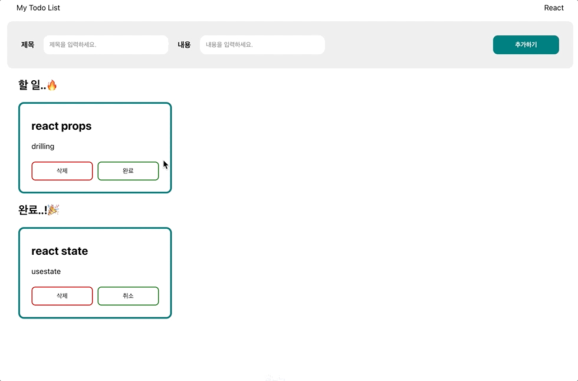

# ToDoList

## 📁 폴더구조

```
📦src
 ┣ 📂components
 ┃ ┣ 📂form
 ┃ ┃ ┣ 📜Form.jsx
 ┃ ┃ ┗ 📜style.css
 ┃ ┗ 📂todolist
 ┃ ┃ ┣ 📜TodoItem.js
 ┃ ┃ ┣ 📜TodoList.jsx
 ┃ ┃ ┗ 📜style.css
 ┣ 📂pages
 ┃ ┣ 📜Main.jsx
 ┃ ┗ 📜style.css
 ┣ 📜App.js
 ┣ 📜App.test.js
 ┣ 📜index.css
 ┣ 📜index.js
 ┣ 📜reportWebVitals.js
 ┗ 📜setupTests.js
```

## 🛠 시연영상



## 🎯 요구사항

- [x] 사용자가 할 일의 제목과 내용을 입력한 후 [추가하기] 버튼을 클릭하면, 새로운 할 일이 목록에 추가되며 입력 필드는 다시 비워집니다.
- [x] 할 일 목록에서 각 항목의 상태에 따라 버튼이 달라집니다. 완료된 할 일의 경우 "취소", 아직 완료되지 않은 할 일의 경우 "완료"로 표시됩니다.
- [x] 할 일 목록에서는 완료되지 않은 할 일이 위에, 완료된 할 일이 아래에 위치하게 됩니다.
- [x] 화면의 최대 너비는 1200px로, 최소 너비는 800px로 설정되며, 화면은 수평 가운데로 정렬됩니다.
